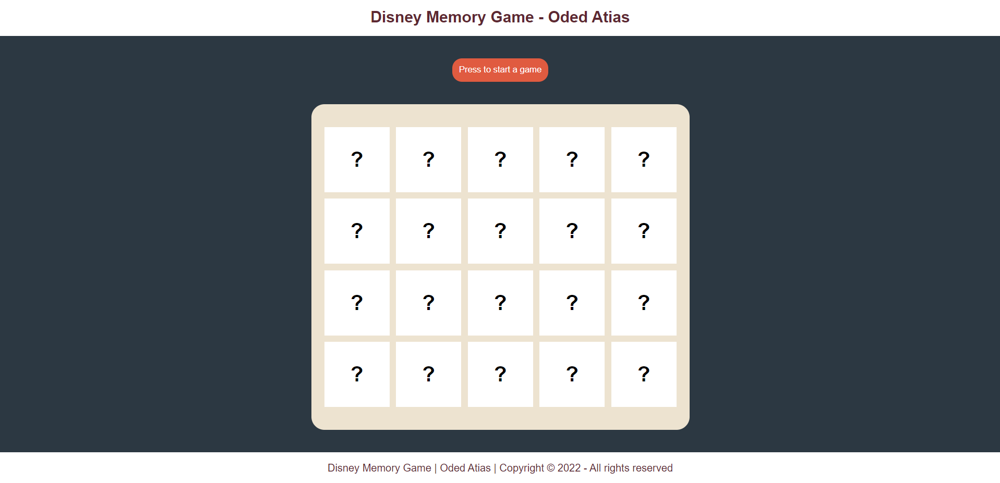

# Disney-Memory-Game 🃏

Implementation of memory game web application with cards from Disney API.



## Technologies

👉 HTML

👉 CSS

👉 JavaScript

## Implementation Remarks

1️⃣ I have added to the program 9 auxiliary functions that will help me perform the task in a simpler way Auxiliary functions for performing the task:

🔹 fetchData - A function with which I import the information from the Disney API.

🔹 generateRandomNumbers - A Function to generate 10 random numbers between 0 to 49 (Disney API bring us array of 50 objects).

🔹 generate10ShuffeledCouples - A Function to select 10 shuffled characters couples.

🔹 renderCards - A Function to display the 20 cards into the DOM.

🔹 checkMove - Function to check the move of the user (when user clicks on card element).

🔹 checkMatch - Function to check if there is a match move (when the user clicks two cards).

🔹 alertMatch - Function to Alert to the user after match (with all the character details).

🔹 displayProp - Function to display specific property values of character card (Auxilliary function to alertMatch).

## Database I used

🔹 DISNEY API

## for any questions

```
if(haveAnyQuestions === true){
    let yourName = ".......", question = ".......";
    sendEmailToMe(yourName,question,odedatias8115@gmail.com);
}
```
